# Table of Contents

1.  [安装clang](#org8103c10)
    1.  [检查是否已经安装clang](#org61c3428)
    2.  [安装clang](#org70579e5)
2.  [下载VS Code并安装](#org9855466)
3.  [安装VS Code C/C++插件](#org4cd05e8)
4.  [添加VS Code到PATH](#orgf16ff59)
5.  [配置VS Code的C语言编译选项](#orgcb2db0a)
    1.  [终端（命令行）下新建一个目录用于存放C的项目：](#orgbf4c71d)
    2.  [将.vscode目录下载下来并放到这个目录下](#orgb788ca4)
    3.  
    4.  [(可选)安装lldb插件](#orgff265b5)
6.  [Hello, World](#orgbccf194)

# 安装clang

## 检查是否已经安装clang

终端命令行下输入： `clang --version` 

    bash-3.2$ clang --version
    Apple clang version 11.0.0 (clang-1100.0.33.16)
    Target: x86_64-apple-darwin19.2.0
    Thread model: posix
    InstalledDir: /Library/Developer/CommandLineTools/usr/bin

如果出现上面的回显，说明已经安装了clang，可以跳过本节，开始[下载VS Code并安装](#org9855466)。

## 安装clang

-   打开终端，输入 `command xcode-select --install`; 并在弹出的窗口中选择 `install`

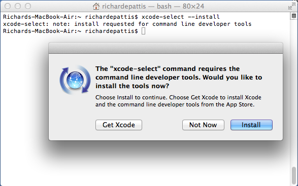

-   接下来的License Agreement对话框中选取Agree：

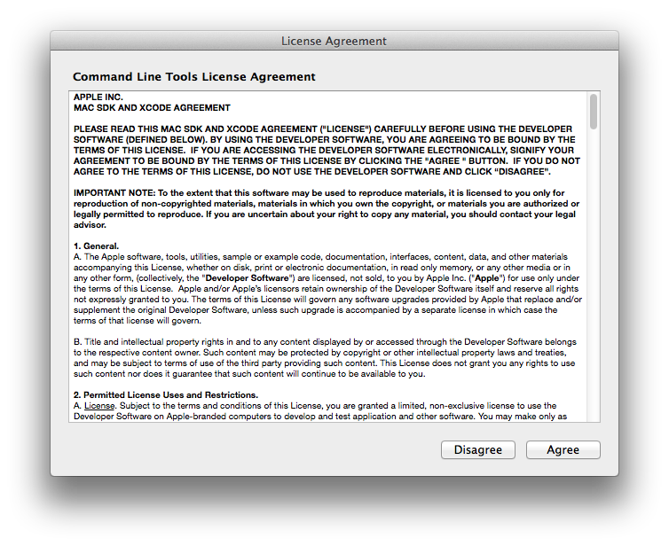

-   出现下载和安装的界面：

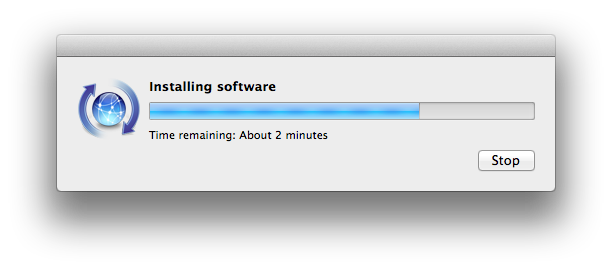

-   安装完成后点击Done：

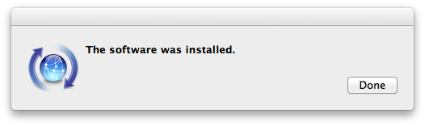

-   确认安装完成：

# 下载VS Code并安装

[下载链接](https://code.visualstudio.com/download)

选择mac os版本下载并安装

# 安装VS Code C/C++插件

打开visual Studio Code，安装c/c++插件:

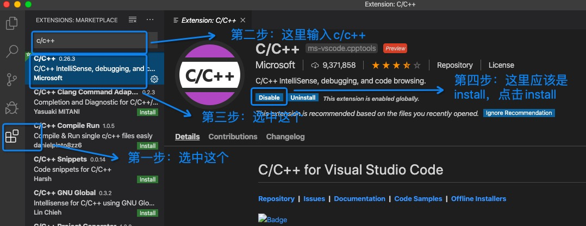

# 添加VS Code到PATH

1.  打开VS code
2.  使用⇧⌘P（同时按住Shift+Command+P）打开VS code命令行
3.  输入“Shell”，从给出的建议中选择 `Shell Command: Install 'code' command in PATH` :
    
    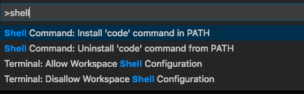

4.  应该会看到VS Code窗口的右下角出现提示：“VS Code was successfully added to the PATH”.
5.  关闭VS Code

# 配置VS Code的C语言编译选项

## 终端（命令行）下新建一个目录用于存放C的项目：

    mkdir c-projects

## 将.vscode目录下载下来并放到这个目录下

## 

[.vscode目录](https://github.com/linc5403/c/tree/master/ide/macos/.vscode)

1.  在c项目目录（上一节新建的c-projects目录）下启动VS Code：
    
        cd c-projects
        code .
    
    此时应该可以出现VS的界面

2.  在VS Code中新建.vscode目录：
    
    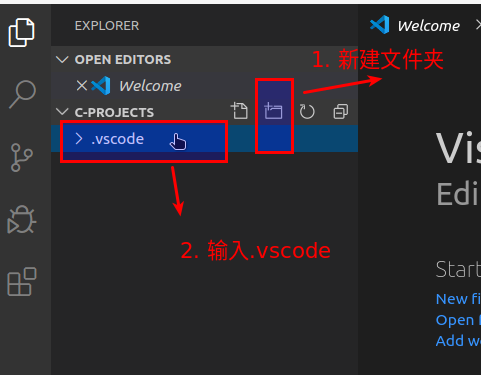

3.  选中.vscode目录, 新建文件（ `c_cpp_properties.json` `launch.json` `tasks.json` ），将github上的3个文件内容分别copy到新建的三个文件中
    
    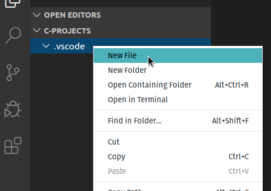
    
    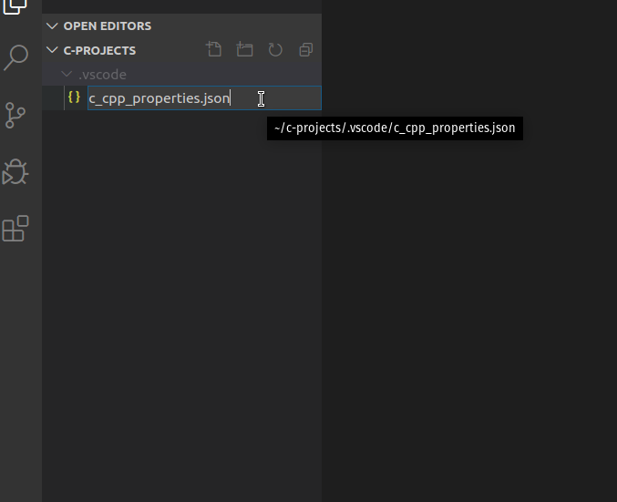
    
    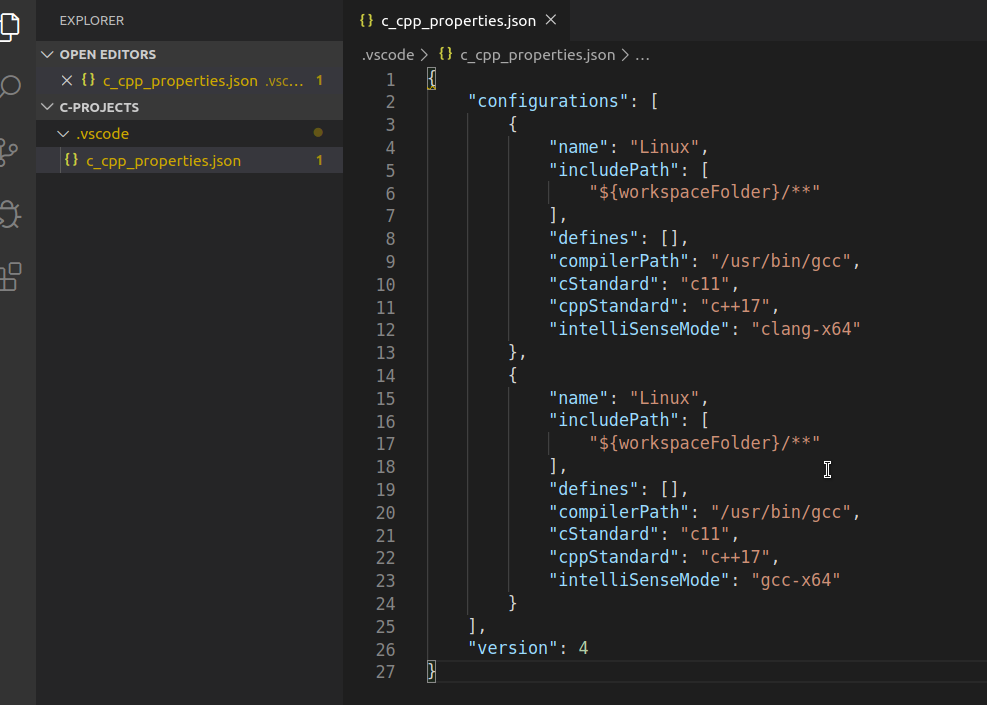

4.  下载和拷贝完成后你的工作目录应该是这个样子的：
    
    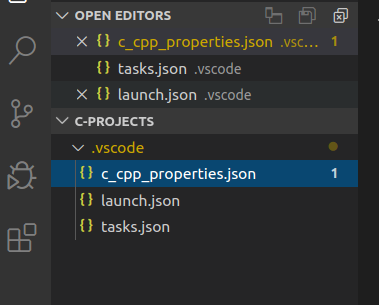
    
        c-projects/
        └── .vscode
          ├── c_cpp_properties.json
          ├── launch.json
          └── tasks.json
    
    **注意** .vscode是隐藏目录，需要使用 `ls -la` 进行查看

## (可选)安装lldb插件

对于MacOS,有可能会出现debug无法在断点时暂停的情况，此时你需要安装lldb的插件来进行debug。

1.  下载该插件：
    
    [vs-code-lldb插件](https://github.com/vadimcn/vscode-lldb/releases/download/v1.4.5/vscode-lldb-x86_64-darwin.vsix)

2.  使用⇧⌘P（同时按住Shift+Command+P）打开VS code命令行并输入 `install from` ，选择出现的 `install form VSIX...`
    
    

3.  在弹出的窗口中选择之前下载的文件 `vscode-lldb-x86_64-darwin.vsix` 
    
    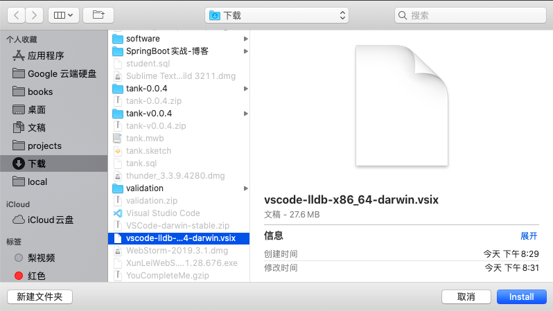

4.  安装后的检查：
    
    安装完成后应在VS Code的插件栏出现lldb插件 `CodeLLDB` ：
    
    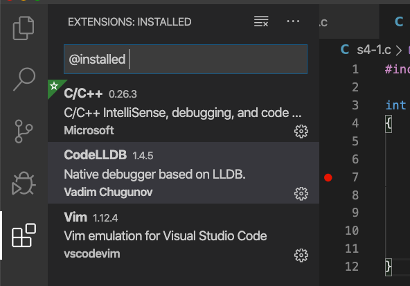

# Hello, World

创建你的第一个C程序并运行吧：

1.  新建文件保存为hello.c，并输入如下代码：
    
        #include <stdio.h>
        
        int main() {
          printf("Hello, world!\n");
          return 0;
        }
    
    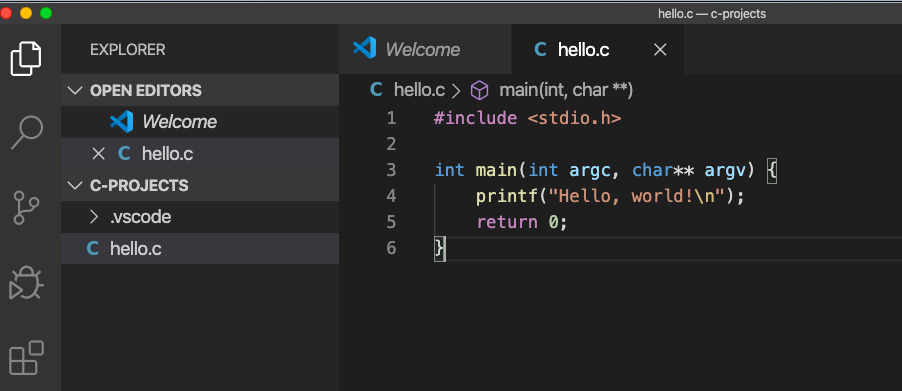
    
    **记得保存文件**

2.  使用⇧⌘B(同时按住Shift+Command+B)进行编译：
    
    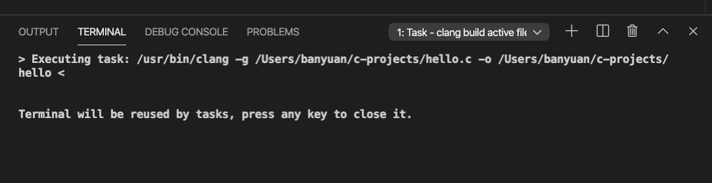

3.  终端下可以看到多出了编译出来的可执行文件：hello
    
        bash-3.2$ ls
        hello           hello.c         hello.dSYM

4.  通过 `./hello` 执行该文件
    
    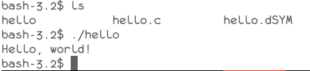

