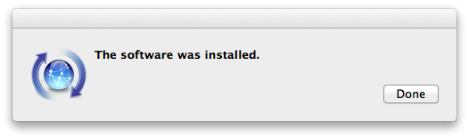
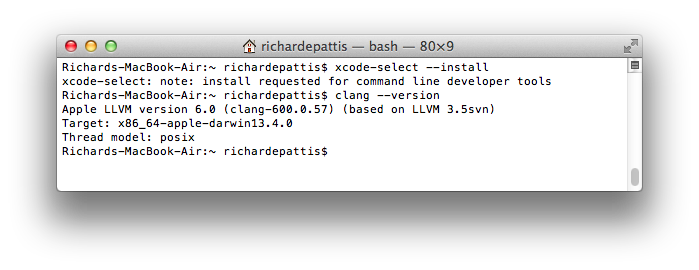
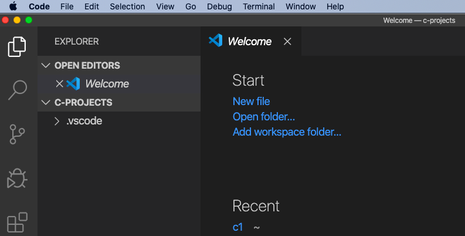

# Table of Contents

1.  [安装clang](#orgddff005)
    1.  [检查是否已经安装clang](#org4f47b36)
    2.  [安装clang](#orgd38f931)
2.  [下载VS Code](#org478fa84)
3.  [安装VS Code C/C++插件](#org7c6eabe)
4.  [添加VS Code到PATH](#org3567104)
5.  [配置VS Code的C语言编译选项](#org753b2e9)
6.  [Hello, World](#orga6898d3)

# 安装clang

## 检查是否已经安装clang

终端命令行下输入： `clang --version` 

    bash-3.2$ clang --version
    Apple clang version 11.0.0 (clang-1100.0.33.16)
    Target: x86_64-apple-darwin19.2.0
    Thread model: posix
    InstalledDir: /Library/Developer/CommandLineTools/usr/bin

如果出现上面的回显，说明已经安装了clang，可以跳过本节，开始[下载VS Code](#org478fa84)。

## 安装clang

-   打开终端，输入 `command xcode-select --install`; 并在弹出的窗口中选择 `install`

-   接下来的License Agreement对话框中选取Agree：

-   出现下载和安装的界面：

-   安装完成后点击Done：

-   确认安装完成：

# 下载VS Code

[下载链接](https://code.visualstudio.com/download)

选择mac os版本下载

# 安装VS Code C/C++插件

打开visual Studio Code，安装c/c++插件:

# 添加VS Code到PATH

1.  打开VS code
2.  使用⇧⌘P（同时按住Shift+Command+P）打开VS code命令行
3.  输入“Shell”，从给出的建议中选择 `Shell Command: Install 'code' command in PATH` :
    
    

4.  应该会看到VS Code窗口的右下角出现提示：“VS Code was successfully added to the PATH”.
5.  关闭VS Code

# 配置VS Code的C语言编译选项

1.  新建一个目录用于存放C的项目：
    
        bash-3.2$ mkdir c-projects

2.  将.vscode目录下载下来并放到这个目录下
    
    [.vscode目录](https://github.com/linc5403/c/tree/master/ide/macos/.vscode)
    
    下载和拷贝完成后你的工作目录应该是这个样子的：
    
        c-projects/
        └── .vscode
          ├── c_cpp_properties.json
          ├── launch.json
          └── tasks.json
    
    **注意** .vscode是隐藏目录，需要使用 `ls -la` 进行查看

3.  用VS Code打开这个目录
    
    就是命令行下进入c-projects目录，然后执行 `code .` 命令：
    
        bash-3.2$ cd c-projects/
        bash-3.2$ pwd
        /Users/banyuan/c-projects
        bash-3.2$ code .
    
    此时应该可以出现VS Code的界面，同时加载了c-projects目录：
    
    

# Hello, World

创建你的第一个C程序并运行吧：

1.  新建文件保存为hello.c，并输入如下代码：
    
        #include <stdio.h>
        
        int main(int argc, char** argv) {
            printf("Hello, world!\n");
            return 0;
        }
    
    
    
    **记得保存文件**

2.  使用⇧⌘B(同时按住Shift+Command+B)进行编译：
    
    

3.  终端下可以看到多出了编译出来的可执行文件：hello
    
        bash-3.2$ ls
        hello           hello.c         hello.dSYM

4.  通过 `./hello` 执行该文件
    
    

