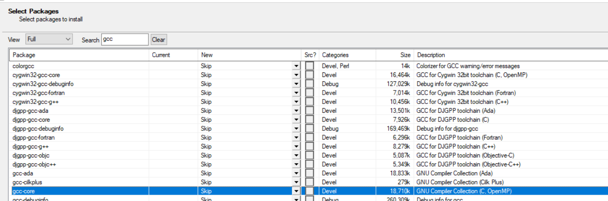
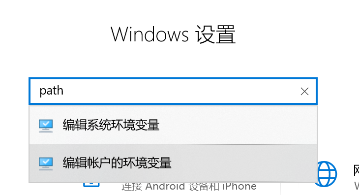
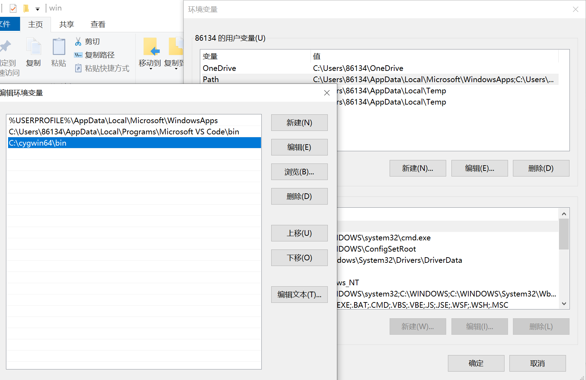
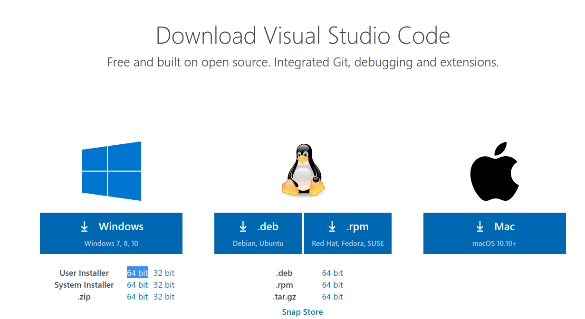
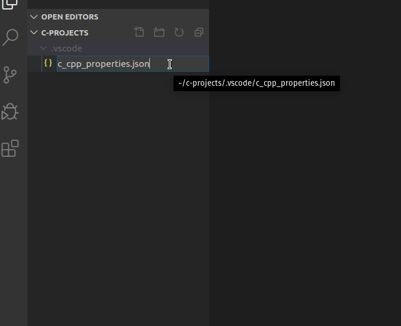

# Table of Contents

1.  [安装cygwin](#org19e6df0)
    1.  [下载安装文件](#org840dc24)
    2.  [安装cygwin](#org7997f21)
        1.  [next到选择站点的时候添加163的地址](#org74f996c)
        2.  [选择gcc和相关软件进行安装](#org82e5283)
        3.  [完成后的确认](#org413c854)
    3.  [添加cygwin到windows的PATH中](#orgafcf580)
2.  [下载VS Code并安装](#orgc3fc779)
3.  [安装VS Code C/C++插件](#org32f86c4)
4.  [配置VS Code的C语言编译选项](#org6f63588)
    1.  [cygwin下新建一个目录用于存放C的项目：](#org76f9998)
    2.  [将.vscode目录下载下来并放到这个目录下](#org029a833)
5.  [Hello, World](#orga4070e9)

# 安装cygwin

## 下载安装文件

下面两个地址任选一个

[官网下载](https://cygwin.com/setup-x86_64.exe)

[我的github下载](https://github.com/linc5403/c/blob/master/ide/win/setup-x86_64.exe)

## 安装cygwin

### next到选择站点的时候添加163的地址

到下面这个页面的时候在Url里面输入 `http://mirrors.163.com/cygwin/` ，点击“Add”按钮。否则下载速度会相当慢。

### 选择gcc和相关软件进行安装

在 `Select Packages` 页面选择3个软件：gcc-core, gdb, cmake。注意左上角View的下拉菜单选中 `Full` ，然后右边可以搜索；双击Skip那个地方选中该软件：

### 完成后的确认

安装完成后桌面会出现cygwin的快捷方式，双击会进入终端界面，在里面输入 `cc --version` 出现如下所示结果表示安装成功：

## 添加cygwin到windows的PATH中

1.  打开windows环境变量设置

1.  添加cygwin的bin目录到环境变量

# 下载VS Code并安装

[下载链接](https://code.visualstudio.com/download)

选择User Installer -> 64bit下载并安装：

安装的时候一路Next就可以了， **重点:安装完成后需要重启电脑** ，因为需要将VS Code添加到系统路径中。

# 安装VS Code C/C++插件

打开visual Studio Code，安装c/c++插件:

# 配置VS Code的C语言编译选项

## cygwin下新建一个目录用于存放C的项目：

    mkdir c-projects

## 将.vscode目录下载下来并放到这个目录下

[.vscode目录](https://github.com/linc5403/c/tree/master/ide/win/.vscode)

1.  在c项目目录（c-projects）下启动VS Code：
    
        cd c-projects
        code .
    
    此时应该可以出现VS的界面

2.  在VS Code中新建.vscode目录：
    
    

3.  选中.vscode目录, 新建文件（ `c_cpp_properties.json` `launch.json` `tasks.json` ），将github上的3个文件内容分别copy到新建的三个文件中
    
    
    
    
    
    

4.  下载和拷贝完成后你的工作目录应该是这个样子的：
    
    
    
        c-projects/
        └── .vscode
          ├── c_cpp_properties.json
          ├── launch.json
          └── tasks.json
    
    **注意** .vscode是隐藏目录，需要使用 `ls -la` 进行查看

# Hello, World

创建你的第一个C程序并运行吧：

1.  新建文件保存为hello.c，并输入如下代码：
    
        #include <stdio.h>
        
        int main(int argc, char** argv) {
            printf("Hello, world!\n");
            return 0;
        }
    
    
    
    **注意** 记得保存文件

2.  使用Ctrl+Shift+B(同时按住Ctrl，Shift和B这三个键)进行编译,出现如下结果表示编译成功：
    
    

3.  cygwin下可以看到多出了编译出来的可执行文件：hello
    
        bash-3.2$ ls
        hello.exe           hello.c

4.  通过 `./hello.exe` 执行该文件
    
    

