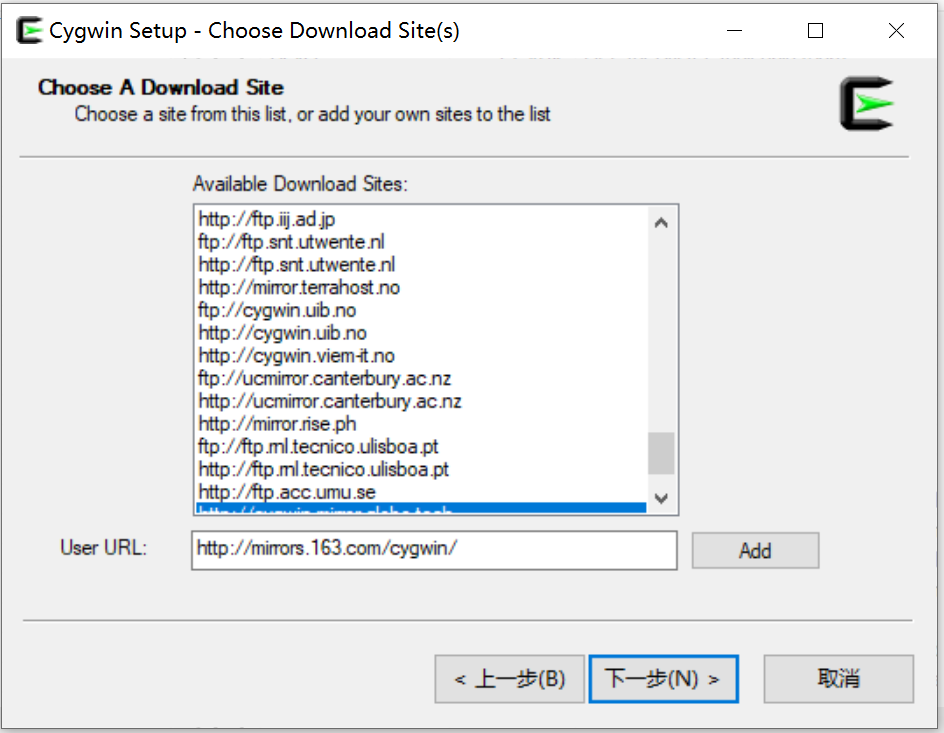
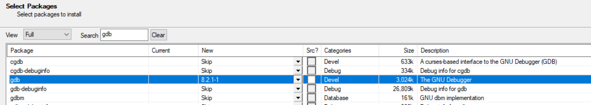
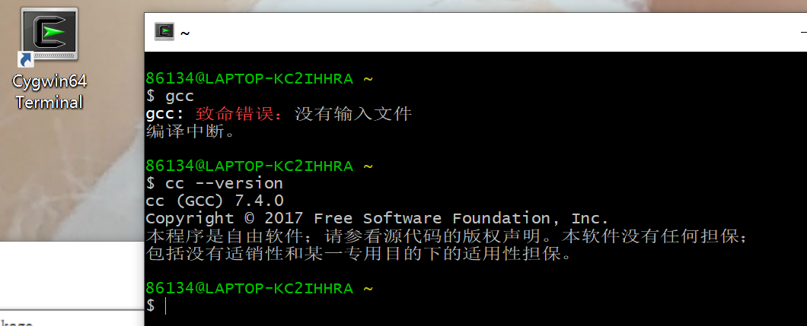
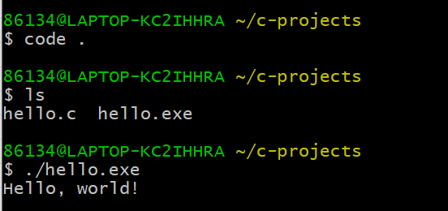

# Table of Contents

1.  [安装cygwin](#orgf7a265c)
    1.  [下载安装文件](#org70214f1)
    2.  [安装cygwin](#org28bbeea)
        1.  [next到选择站点的时候添加163的地址](#org43ad288)
        2.  [选择gcc和相关软件进行安装](#orgeb423b7)
        3.  [完成后的确认](#orgb06bf56)
2.  [下载VS Code并安装](#org4f7ea00)
3.  [安装VS Code C/C++插件](#orgd3dbc93)
4.  [配置VS Code的C语言编译选项](#org07e58fd)
5.  [Hello, World](#org5dbf892)

# 安装cygwin

## 下载安装文件

下面两个地址任选一个

[官网下载](https://cygwin.com/setup-x86_64.exe)

[我的github下载](https://github.com/linc5403/c/blob/master/ide/win/setup-x86_64.exe)

## 安装cygwin

### next到选择站点的时候添加163的地址

到下面这个页面的时候在Url里面输入 `http://mirrors.163.com/cygwin/` ，点击“Add”按钮。否则下载速度会相当慢。

### 选择gcc和相关软件进行安装

在 `Select Packages` 页面选择3个软件：gcc-core, gdb, cmake。注意左上角的下拉菜单选中~View~，然后右边可以搜索；双击Skip那个地方可以选中该软件：

### 完成后的确认

安装完成后桌面会出现cygwin的快捷方式，双击会进入终端界面，在里面输入 `cc --version` 出现如下所示结果表示安装成功：

# 下载VS Code并安装

[下载链接](https://code.visualstudio.com/download)

选择User Installer -> 64bit下载并安装：

选择Windows版本下载

安装的时候一路Next就可以了， **重点:安装完成后需要重启电脑** ，因为需要将VS Code添加到系统路径中。

# 安装VS Code C/C++插件

打开visual Studio Code，安装c/c++插件:

# 配置VS Code的C语言编译选项

1.  cygwin下新建一个目录用于存放C的项目：
    
        bash-3.2$ mkdir c-projects

2.  将.vscode目录下载下来并放到这个目录下
    
    [.vscode目录](https://github.com/linc5403/c/tree/master/ide/win/.vscode)
    
    下载和拷贝完成后你的工作目录应该是这个样子的：
    
        c-projects/
        └── .vscode
          ├── c_cpp_properties.json
          ├── launch.json
          └── tasks.json
    
    **注意** .vscode是隐藏目录，需要使用 `ls -la` 进行查看

3.  用VS Code打开这个目录
    
    就是在cygwin中进入c-projects目录，然后执行 `code .` 命令（注意这个小点点不要忘了）：
    
        bash-3.2$ cd c-projects/
        bash-3.2$ pwd
        /Users/banyuan/c-projects
        bash-3.2$ code .
    
    此时应该可以出现VS Code的界面，同时加载了c-projects目录：
    
    

# Hello, World

创建你的第一个C程序并运行吧：

1.  新建文件保存为hello.c，并输入如下代码：

    #include <stdio.h>
    
    int main(int argc, char** argv) {
        printf("Hello, world!\n");
        return 0;
    }

**注意** 记得保存文件

1.  使用Ctrl+Shift+B(同时按住Ctrl，Shift和B这三个键)进行编译, 选择出现的 `gcc.exe build active file` ：
    
    

2.  cygwin下可以看到多出了编译出来的可执行文件：hello
    
        bash-3.2$ ls
        hello           hello.c

3.  通过 `./hello` 执行该文件
    
    

