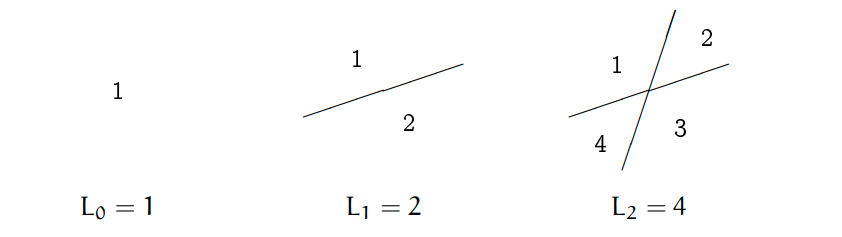

# Table of Contents

1.  [bit运算](#org1f9acf8)
2.  [使用直线划分空间](#org16206b9)
3.  [打印三角形](#orge3e70e0)
4.  [实现atof函数](#org3fc40f9)
5.  [使用栈的数据结构实现队列的功能](#orgebf9c51)

# bit运算

新生报道有1000人, 按每个班最多32个人进行划分,应该如何用bit运算得出最少需要多少个班?

    要求:  给出计算方法即可, 不用完整程序

# 使用直线划分空间

如下图所示:

-   0根直线可以划分出1个空间
-   1根直线可以划分出2个空间
-   2根直线可以划分出4个空间

**问题**:

1.  写出公式L(n); n表示直线数量, L(n)表示通过n根直线可以划分出的最多的空间数量
2.  使用C语言实现计算L(n)的函数
    
        int calc_spaces(int n); // n >= 0

# 打印三角形

观察上图三角形的规律,实现函数根据输入n打印n行如图所示三角形.

    void draw(unsigned int n); // n > 0

# 实现atof函数

-   函数定义
    
        double my_atof(char *nptr);
-   函数描述
    
    myatof()会扫描参数nptr字符串，跳过前面的空格字符，直到遇上数字或 `.` 符号才开始做转换，而再遇到非数字或字符串结束时('\\0')才结束转换，并将结果返回。
    
    以下都是合法输入:
    
        0.123
        .123
        16.4
        16.
        0.0
        0.
    
        注意: 不考虑 +- 符号, 不考虑输入非法的情况

# 使用栈的数据结构实现队列的功能

1.  你有完整的栈的数据结构可以使用:
    
    [stack.c](https://github.com/linc5403/ds-c/blob/master/code/02-stack/stack.c)
    
    [stack.h](https://github.com/linc5403/ds-c/blob/master/code/02-stack/stack.h)

2.  只能使用上面文件中提供的方法来实现队列的enqueue和dequeue方法, 函数声明如下:
    
        enqueue(Queue* queue, int data); // 函数类型请自己考虑
        int dequeue(Queue* queue);
    
    -   `Queue` 的定义在stack.h文件中
    -   上面的两个函数里面只能调用已有的函数,不能使用其他方法对入参queue进行操作
    -   测试用例如下:
        
            int main(void) {
                Queue* queue = init_stack();
                int a[5] = {1, 2, 3, 4, 5};
                for( int i = 0; i < 5; i++) {
            	enqueue(queue, a[i]);
                }
            
                for (int i = 0; i < 5; i++) {
            	int out = dequeue(queue);
            	printf("%3d", out);
                }
                printf("\n");
                return 0;
            }
        
        程序应当输入类似: 1  2  3  4  5

