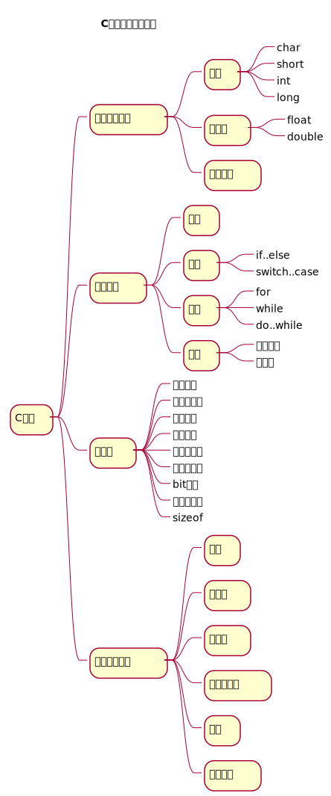

# Table of Contents

1.  [C语言入门](#org7fe6ee2)
    1.  [课程安排](#org4e5d0de)
    2.  [学习路线](#org0833ae0)
    3.  [学习资料](#org9d1bba3)
    4.  [学习方法](#orgcaaa107)

# C语言入门

## 课程安排

<table border="2" cellspacing="0" cellpadding="6" rules="groups" frame="hsides">

<colgroup>
<col  class="org-left" />

<col  class="org-right" />
</colgroup>
<thead>
<tr>
<th scope="col" class="org-left">课程内容</th>
<th scope="col" class="org-right">学时</th>
</tr>
</thead>

<tbody>
<tr>
<td class="org-left">C语言引导</td>
<td class="org-right">2</td>
</tr>

<tr>
<td class="org-left">如何使用C语言解决问题</td>
<td class="org-right">2</td>
</tr>

<tr>
<td class="org-left">程序结构-分支</td>
<td class="org-right">2</td>
</tr>

<tr>
<td class="org-left">程序结构-循环</td>
<td class="org-right">2</td>
</tr>

<tr>
<td class="org-left">程序结构-函数</td>
<td class="org-right">2</td>
</tr>

<tr>
<td class="org-left">数据类型和表达式</td>
<td class="org-right">2</td>
</tr>

<tr>
<td class="org-left">数组</td>
<td class="org-right">2</td>
</tr>

<tr>
<td class="org-left">结构体</td>
<td class="org-right">2</td>
</tr>

<tr>
<td class="org-left">指针</td>
<td class="org-right">4</td>
</tr>
</tbody>

<tbody>
<tr>
<td class="org-left">合计</td>
<td class="org-right">20</td>
</tr>
</tbody>
</table>

## 学习路线

## 学习资料

-   [教材](https://wiki.banyuan.club/pages/viewpage.action?pageId=3051654)

## 学习方法

-   善于总结
-   勤加练习
-   主动提问

