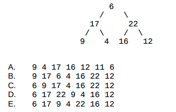
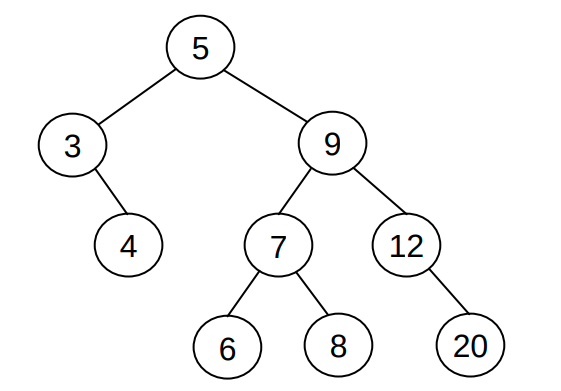
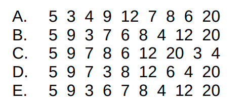

# Table of Contents

1.  [简答题](#orgff3cabe)
    1.  [分苹果](#org72de811)
    2.  [总线问题](#orgf76976e)
2.  [下面C语言的输出是什么, 并给出解释](#org184f39f)
3.  [给出下面C语言程序的输出, 并解释为什么](#org823bcf7)
4.  [下面C语言会输出什么, 并给出解释](#orgb3f6618)
5.  [二叉树如下,使用先序遍历的结果是:](#orgc249736)
6.  [二叉搜索树如下, 请问以何种顺序输入无法构造这样的二叉树](#org2446851)
7.  [将如下输入转换为最大堆](#orgcf5863f)
8.  [将如下输入转换为最小堆](#org38b2d98)
9.  [使用直线划分空间](#orgd66bc79)
10. [使用折线划分空间](#org2251759)
11. [打印三角形](#org5670894)
12. [实现atof函数](#orgce645cf)
13. [使用栈的数据结构实现队列的功能](#orgde9c164)
14. [彩票生成器](#org2af800f)

# 简答题

## 分苹果

一共2000个苹果，有任意多个箱子用来装苹果，要求一个或多个箱子中的苹果数量之和可以得到1到2000中的任意数目的苹果。

请问最少需要多少个箱子才能满足上述条件？

## 总线问题

某计算机内存为64MB, 一共有64条不同的指令, 子长为4字节, 请问至少需要多少根地址总线和数据总线.

# 下面C语言的输出是什么, 并给出解释

    char p[20]; 
    char *s = "string"; 
    int length = strlen(s); 
    int i; 
    for (i = 0; i < length; i++) 
         p[i] = s[length - i]; 
    printf("%s",p);

-   a) gnirts
-   b) gnirt
-   c) string
-   d) 没有输出

# 给出下面C语言程序的输出, 并解释为什么

    #include <stdio.h>
    
    int main() {
        if (sizeof(int) > -1)
    	printf("True");
        else
    	printf("False");
    }

# 下面C语言会输出什么, 并给出解释

    #include <stdio.h>
    main()
    {
        int n = 0, m = 0;
        if (n > 0)
    	if (m > 0)
    	    printf("True");
        else 
    	printf("False");
    }

-   a) True
-   b) False
-   c) 没有输出
-   d) 运行错误

# 二叉树如下,使用先序遍历的结果是:

# 二叉搜索树如下, 请问以何种顺序输入无法构造这样的二叉树

# 将如下输入转换为最大堆

    {1, 2, 8, 10, 20, 6, 16, 14, 31, 7}

**提示**:  结果应当是唯一的; 你可以使用数组或是画图作为答案.

# 将如下输入转换为最小堆

    {1, 2, 8, 10, 20, 6, 16, 14, 31, 7}

**提示**:  结果应当是唯一的; 你可以使用数组或是画图作为答案.

# 使用直线划分空间

如下图所示:

-   0根直线可以划分出1个空间
-   1根直线可以划分出2个空间
-   2根直线可以划分出4个空间

**问题**:

1.  写出公式L(n); n表示折线数量, L(n)表示通过n根折线可以划分出的最多的空间数量
2.  使用C语言实现计算L(n)的函数
    
        int calc_line_spaces(int n); // n >= 0

# 使用折线划分空间

如下图所示:

-   0根折线可以划分出1个空间
-   1根折线线可以划分出2个空间
-   2根折线最多可以划分出7个空间

**问题**:

1.  写出公式Z(n); n表示折线数量, Z(n)表示通过n根折线可以划分出的最多的空间数量
2.  使用C语言实现计算Z(n)的函数
    
        int calc_zig_spaces(int n); // n >= 0

# 打印三角形

观察上图三角形的规律,实现函数根据输入n打印n行如图所示三角形.

    void draw(unsigned int n); // n > 0

# 实现atof函数

-   函数定义
    
        double my_atof(char *nptr);
-   函数描述
    
    `my_atof()` 会扫描参数nptr字符串，跳过前面的空格字符，直到遇上数字或 `.` 符号才开始做转换，而遇到非数字或字符串结束时('\\0')才结束转换，并将结果返回。
    
    以下都是合法输入:
    
        0.123
        .123
        16.4
        16.
        0.0
        0.
    
        注意: 不考虑 +- 符号, 不考虑输入非法的情况

# 使用栈的数据结构实现队列的功能

1.  你有完整的栈的数据结构可以使用:
    
    [stack.c](https://github.com/linc5403/ds-c/blob/master/code/02-stack/stack.c)
    
    [stack.h](https://github.com/linc5403/ds-c/blob/master/code/02-stack/stack.h)

2.  只能使用上面文件中提供的方法来实现队列的enqueue和dequeue方法, 函数声明类似如下:
    
        enqueue(Queue* queue, int data); // 函数定义请自己考虑
        int dequeue(Queue* queue); // 函数定义请自己考虑
    
    -   `Queue` 结构体的定义在stack.h文件中
    -   上面的两个函数里面只能调用已有的函数,不能使用其他方法对入参queue进行操作
    -   测试用例类似如下:
        
            int main(void) {
                Queue* queue = init_stack();
                int a[5] = {1, 2, 3, 4, 5};
                for( int i = 0; i < 5; i++) {
            	enqueue(queue, a[i]);  // 可按照自己的函数定义进行修改
                }
            
                for (int i = 0; i < 5; i++) {
            	int out = dequeue(queue); // 可按照自己的函数定义进行修改
            	printf("%3d", out);
                }
                printf("\n");
                return 0;
            }
        
        程序应当输出类似结果: 1  2  3  4  5

# 彩票生成器

`从红色球号码（1-33）中选择6个号码，从蓝色球号码（1-16）中选择1个号码，组合为一注号码。`

请你根据上述规则实现程序, 生成一个彩票的号码.

